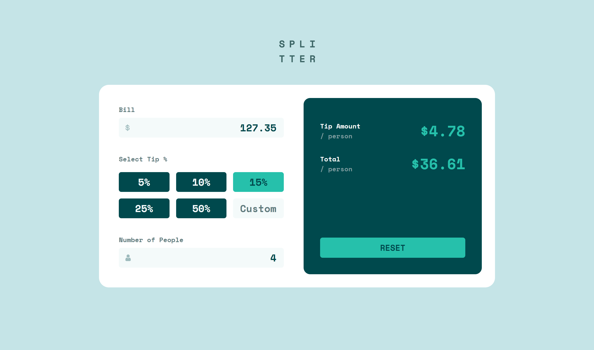
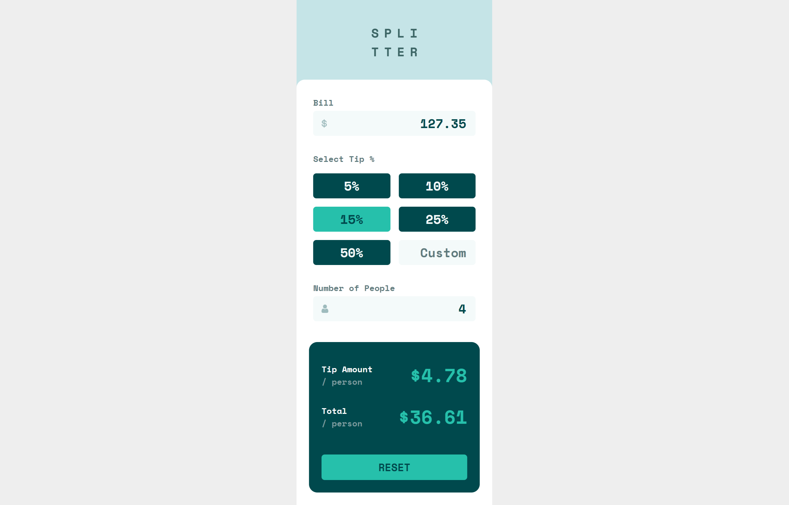

# Frontend Mentor - Tip calculator app solution

This is a solution to the [Tip calculator app challenge on Frontend Mentor](https://www.frontendmentor.io/challenges/tip-calculator-app-ugJNGbJUX). Frontend Mentor challenges help you improve your coding skills by building realistic projects.

- Live Site URL: [https://crsimpson5.github.io/tip-calculator/](https://crsimpson5.github.io/tip-calculator/)

## Overview

### The challenge

Users should be able to:

- View the optimal layout for the app depending on their device's screen size
- See hover states for all interactive elements on the page
- Calculate the correct tip and total cost of the bill per person

### Screenshots




## My process

### Built with

- Semantic HTML5 markup
- CSS custom properties
- Flexbox
- CSS Grid
- Mobile-first workflow

### What I learned

This project was great practice for creating responsive layouts with CSS Grid.

I learned about the `pointer-events` property which allowed me to overlay an SVG over the input field without it blocking a click on the input.

```css
.input-wrapper > img {
  pointer-events: none;
  ...
}
```

### Useful resources

This article by Sara Soueidan helped me understand the auto-fit and auto-fill properties of CSS Grid:
[https://css-tricks.com/auto-sizing-columns-css-grid-auto-fill-vs-auto-fit/](https://css-tricks.com/auto-sizing-columns-css-grid-auto-fill-vs-auto-fit/)
